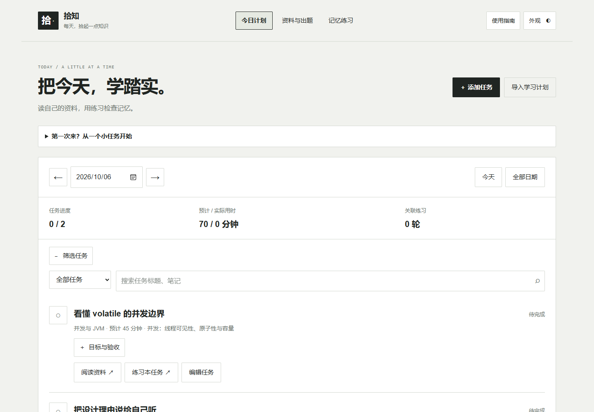
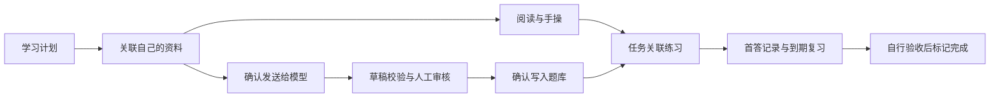

# 拾知

**存一点资料，学一点知识，再回想一次。**

拾知是一个放在自己电脑上的学习小站。把学习计划、资料和练习放在同一处：知道今天要做什么，读完有题可练，忘记了还能回来复习。

不用模型也能保存资料、安排任务、练习已有题目。需要新题时，再让 AI 根据你选定的资料起草，自己核对后写入题库。



[开始使用](#一段话安装) · [第一次体验](#第一次打开做这四步) · [更多提示词](prompts/first-use.md) · [下载源码](https://github.com/chaosmakerw/codesprint-studio/releases/latest)

## 一段话安装

如果已经使用 Codex 或其他可以操作本机文件的编码 Agent，复制下面这段话给它。普通聊天工具不能替你安装，仍可使用后面的手动步骤。

```text
请帮我安装并启动“拾知”：
https://github.com/chaosmakerw/codesprint-studio

1. 先检查电脑系统、Python 和合适的安装目录。应用需要 Python 3.12+，
   不需要 Node、npm 或 pip 依赖。缺 Python 时从官方来源安装；遇到必须
   由我完成的系统授权时，只告诉我当前需要的操作。
2. 下载仓库。若目录已存在，先确认是该项目、检查未提交修改和本机数据；
   先备份，不覆盖文件，不直接 reset/clean 或强行 pull。
3. 从项目目录运行 python run.py --open；Windows 也可用
   py -3.12 run.py --open 或 START.cmd。默认只监听 127.0.0.1。
   如果端口被占用，使用 --port 8770，不结束其他应用的进程。
4. 先不配置 AI，不索取我的 API Key，不上传私有资料。检查首页、
   学习计划、资料和练习入口是否正常；需要验证数据时用独立临时目录，
   不把测试内容写进我的资料库，不替我标记学习完成。
5. 完成后告诉我：访问地址、安装目录、数据目录、启动与停止方法，
   以及下一步如何导入原创示例。故障先按实际错误排查，不提交私人数据。
```

也可以自己启动：安装 [Python 3.12 或以上](https://www.python.org/downloads/)，下载最新源码 ZIP 并解压，Windows 双击 `START.cmd`；或者在项目目录运行：

```bash
git clone https://github.com/chaosmakerw/codesprint-studio.git
cd codesprint-studio
python run.py --open
```

默认打开 `http://127.0.0.1:8768`。保留服务窗口，按 `Ctrl+C` 停止；端口占用时运行 `python run.py --port 8770 --open`。所有资料保存在运行服务的电脑上。

## 第一次打开，做这四步

1. **先试一轮。** 进入“资料与出题”，点击“导入原创示例”，得到六篇原创 Java 短讲义和 18 道示例题；选一份阅读，再开始记忆练习。首次启动为空库，示例不会自动导入。
2. **安排今天。** 在学习计划中添加任务，填写日期、预计时间、学习目标与验收；可以关联资料和练习领域，也可以预览后导入整份 JSON 计划。
3. **换成自己的内容。** 上传笔记、代码或文本资料，搜索、分类、收藏；需要新题时，到 AI 题库工坊少量生成草稿，核对答案、解析和原文证据后确认写入。
4. **从任务开始练习。** 任务可带着对应领域和资料进入刷题，结果回到任务记录；完成阅读、手操与自己的验收后，再手动标记完成。错题和猜题留到复习时再练。

页面里的提示词可以复制给自己的助手。复制不会发送资料，也不会连接你的 Codex / ChatGPT 账号；需要提供目标或内容时，由你自己决定。[首次使用提示词](prompts/first-use.md)还包含制定计划、整理资料、安全升级和排错的完整示例。

## 学习计划 + 资料 + 练习

| 想做的事 | 在拾知里怎么做 |
| --- | --- |
| 今天学什么 | 按日期查看任务、预计时间，关联资料与领域；手动记录完成和实际时间 |
| 保存与找资料 | 上传原件、正文搜索、分类、收藏、回收站与原件下载 |
| 根据资料出题 | 指定关键词和考察角度 → AI 草稿 → 核对原文证据 → 确认写入 |
| 验证记忆 | 领域内随机抽题、练习 / 测验、单选 / 多选、猜题标记、中断续做 |
| 防止忘记 | 错题、猜题和到期复习；保留每轮首答和历史结果 |
| 换一个学习空间 | Studio、Paper、Terminal、Dusk 四种原创外观，手机布局使用可点按的完整按钮 |
| 迁移或留副本 | 完整 ZIP 备份与恢复，包含计划、资料、题库和练习记录 |

计划保存在本机同一份数据库中。导入最多 100 个任务，同一稳定 ID 的已有任务会跳过，不覆盖原内容或进度。刷题成绩只是本轮辨认能力的证据，**不会自动标记任务完成，也不代表已经能独立手写或通过面试**。

## 让 AI 帮忙起草题目

AI 出题是可选功能。复制 `.env.example` 为本机 `.env`，填写自己的供应商配置，再重启服务：

```dotenv
AI_BASE_URL=https://api.openai.com/v1
AI_MODEL=YOUR_MODEL_ID
AI_API_KEY=YOUR_API_KEY
```

适配器使用兼容 Chat Completions 的公开 HTTPS 服务，并要求支持 JSON 对象输出。模型、API Key 和费用由使用者自行准备；ChatGPT / Codex 登录及订阅不会自动变成本站的 API 额度。不要把密钥发到聊天、Issue 或 GitHub，直接在本机填写。

在题库工坊选择资料、领域、题数、关键词和考察角度。优先考察机制、典型场景、边界、排错和设计取舍；资料没有支持的知识，不能靠增加关键词补造。文本提取支持常见笔记与代码文件；PDF 等文件可以存放下载，出题请另行提供自己有权使用的文本摘录。

每题需要四个不同选项、明确答案、整体与逐项解析、逐字原文证据。服务端检查结构、答案集合、重复题干和来源版本，但**校验通过不等于事实正确**。始终先看草稿，再确认写入。详见 [出题质量说明](docs/QUESTION_QUALITY.md)和[出题协议](prompts/question-author.md)。

## 做题与复习规则

领域内随机抽题，轮内不重复，选项每轮打乱。多选必须选中全部正确项，少选或多选均不计分。首答保存后不可改写，重复提交不会增加次数。练习答后讲解，测验交卷后讲评。

整轮首答正确率达到 **80%** 为本轮通过，未答题仍计入分母。猜对也进入复习；错题和猜题约十分钟后到期，到期答对后依次安排 1 / 3 / 7 / 14 / 30 天间隔，提前答对不会延长原定日期。资料进入回收站或来源版本改变时，相关题目暂停出题，历史记录保留。

## 选一个舒服的界面

| Paper / 书页 | Terminal / 深绿 |
| --- | --- |
|  |  |

| Dusk / 夜读 | 手机布局 |
| --- | --- |
|  |  |

系统字体与原创 HTML / CSS / JavaScript，不下载外部字体或媒体。切换主题不会清空内容。手机截图展示响应式排版；当前开源版需要电脑运行服务，**不是手机安装包或手机独立离线应用**，也不会默认开放局域网访问。

## 保存与隐私

运行数据在 `data/`，可通过 `--data-dir` 指定位置。页面导出备份包含资料原件、任务、草稿、题库、收藏、回收站与练习记录；恢复会替换当前数据，先备份再恢复。备份不包含 `.env`，但可能包含你的私密资料，文件本身不加密。

默认只监听本机，未提供公网多用户隔离。上传、计划和刷题不会调用模型；只有你明确确认 AI 出题时，选定资料正文及设置才发送到所配置的供应商。项目不会自动把资料上传 GitHub。不要提交 `.env`、数据库、上传文件或备份。详细边界与私密漏洞报告见 [SECURITY.md](SECURITY.md)。

## 给开发者

Python 标准库 HTTP 服务 + SQLite + 原生 JavaScript，没有应用运行时第三方依赖。固定答案负责判分，AI 负责草稿。



`web/` 是界面，`src/codesprint/` 是服务与存储，`prompts/` 是可审阅提示词，`examples/` 是原创示例，`tests/` 是验证，`data/` 是不提交的私有数据。接口与计划导入契约见 [API 文档](docs/API.md)。

```bash
python -m unittest discover -s tests/backend -v
python -m unittest discover -s tests/audit -v
python scripts/audit_public.py
```

浏览器检查使用 `scripts/verify_browser.cjs`，开发者需另备 Playwright 与 Chromium。它们不属于运行应用的依赖。实际结果、真实对象与测试替身、未验证范围见 [验证报告](docs/VERIFICATION.md)，不能将测试通过等同于真实模型或公网环境验收。

## 开源与创作

这是我的第一个开源项目，使用 **OpenAI Codex** 协作完成。Codex 参与界面设计、代码实现与测试；我负责提出需求、决定产品方向、审阅结果和维护发布。

维护者：[chaosmakerw](https://github.com/chaosmakerw)。可授权的原创代码、文档、UI 和示例采用 **[Apache-2.0](LICENSE)**；保留适用版权与署名，允许按许可证使用、修改和商业分发，不转移作者现有版权，也不授予商标背书权利。

用户上传与运行时生成的内容不会自动纳入开源许可。仓库不分发个人记录、外部课程全文、游戏素材或音乐。AI 输出仍需核对事实、来源和使用权限。见 [NOTICE](NOTICE)、[第三方声明](THIRD_PARTY_NOTICES.md)和[开源审计](docs/OPEN_SOURCE_AUDIT.md)。

首次使用说明借鉴了 [codex-with-chatgpt](https://github.com/XiaoDuoYa/codex-with-chatgpt) 将安装需求整理成可复制提示词的呈现方式，本文提示词为拾知重新编写。拾知不依赖或安装该项目。

欢迎反馈问题与贡献代码，详见 [CONTRIBUTING.md](CONTRIBUTING.md)。希望这里能成为你愿意常回来的学习角落。
