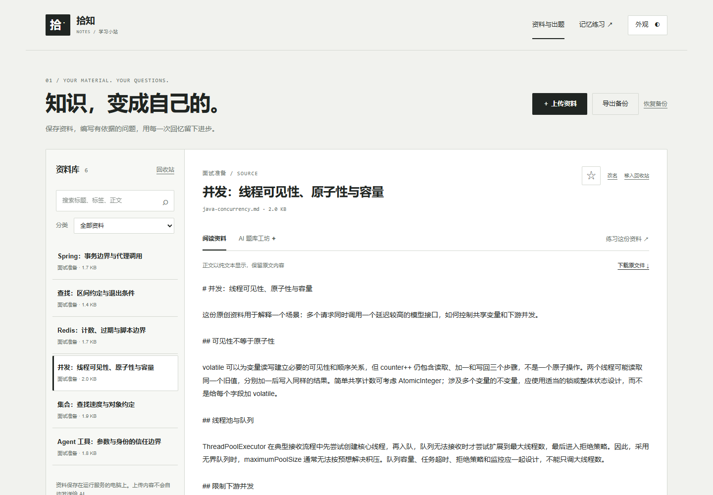
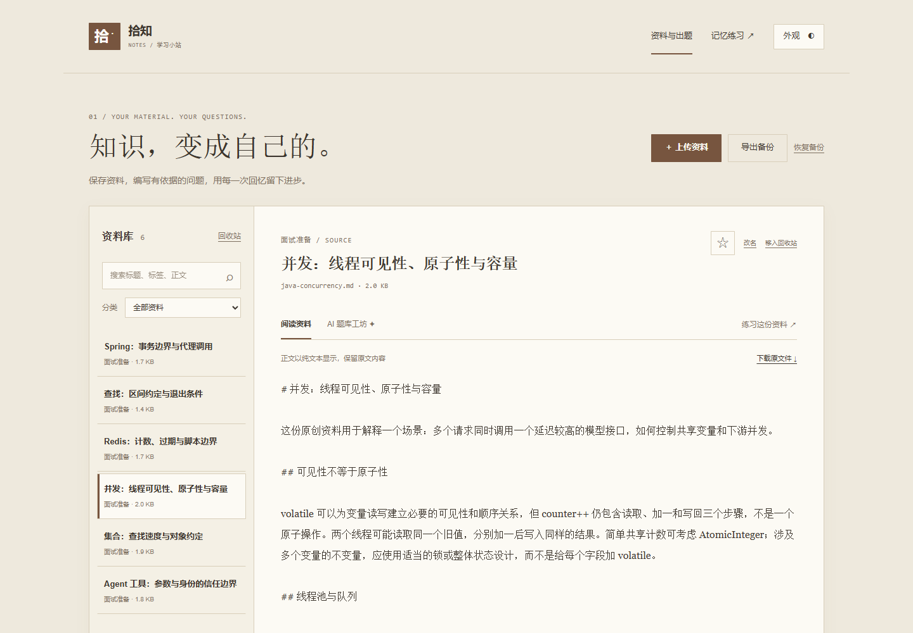
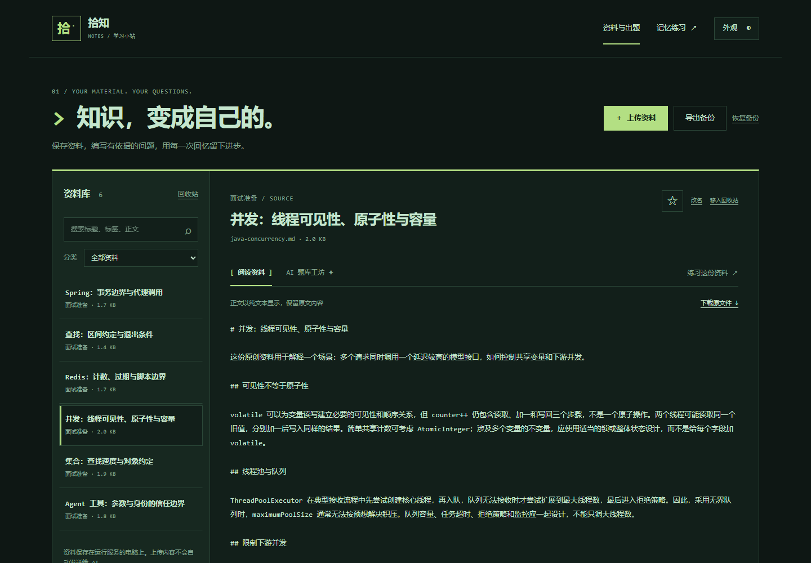
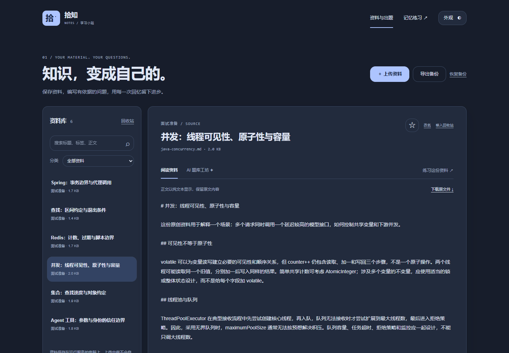
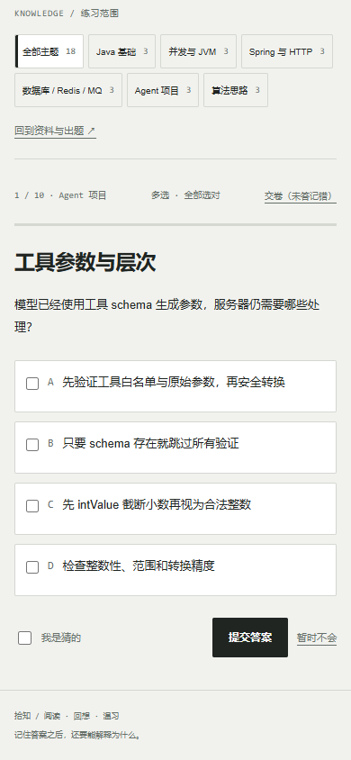
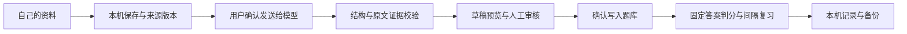

# 拾知

**把自己的资料，变成可以反复练习的知识。**

一个用来存笔记、练回忆的小站。作为准备 Java 后端实习的学生，我有许多笔记，却很难判断自己是否真的记住、能否解释，于是把资料保存、出题审核和记忆练习放在了一起。

你可以从一份自己的资料开始，慢慢整理，反复温习。欢迎反馈问题、贡献代码，也欢迎把它改成适合自己的学习空间。



## 能做什么

- **保存自己的资料**：本机上传、正文搜索、分类、收藏、回收站、原件下载，以及完整 ZIP 备份与恢复。
- **AI 起草，你来确认**：选定资料、知识关键词和考察角度，生成带原文证据与逐项解析的题目草稿；审核后才写入题库。
- **稳定的记忆练习**：按领域随机抽题，单选、多选、练习与测验、猜题标记、错题和到期复习，中断后继续。
- **四种原创外观**：Studio 黑白工作台、Paper 书页编辑室、Terminal 深绿终端、Dusk 冷色夜读。选择保存在浏览器中。
- **不需要密钥也能体验**：首次启动为空库；点击“导入原创示例”，得到六篇原创 Java 短讲义与 18 道完整示例题。

资料保存在运行服务的电脑上。上传和已有题目练习不会调用模型；只有明确确认 AI 出题时，所选资料正文及出题设置才发送到自行配置的供应商。项目不自动同步或上传你的资料到 GitHub。

## 开始使用

需要 **Python 3.12 或以上**和现代浏览器；运行应用不需要安装 npm 包或第三方 Python 包。

```bash
git clone https://github.com/chaosmakerw/codesprint-studio.git
cd codesprint-studio
python run.py --open
```

Windows 可以双击 `START.cmd`，或使用 `py -3.12 run.py --open`。打开 `http://127.0.0.1:8768`。保留服务窗口，按 Ctrl+C 停止。端口占用时运行 `python run.py --port 8770 --open`，不必结束其他应用。

第一次建议先导入原创示例，选一份阅读，再进入“记忆练习”。之后上传自己的笔记，配置模型，少量生成草稿，逐题检查答案和证据再写入。

## 配置 AI 出题

复制 `.env.example` 为本机 `.env`，填写自己的配置，再重启服务：

```dotenv
AI_BASE_URL=https://api.openai.com/v1
AI_MODEL=YOUR_MODEL_ID
AI_API_KEY=YOUR_API_KEY
```

适配器使用兼容 Chat Completions 的公开 HTTPS 服务，要求支持 JSON 对象输出。模型与 Key 均由使用者提供；没有配置时，资料、示例题和记忆练习仍可正常使用。不同供应商的兼容程度、可用模型、费用和隐私规则需要自行核对；本项目不会使用你的 ChatGPT / Codex 登录凭据。

在“AI 题库工坊”选择领域、题数、关键词与角度。关键词模板覆盖集合、并发 / JVM、Spring、Redis / MQ 和 Agent 安全边界，支持自行编辑。机制、场景、边界、故障判断和设计取舍优先于冷门记忆题；资料没有支持的知识不能靠关键词补造。

每题必须有四个不同选项、明确答案、整体与逐项解析、逐字原文证据。服务器拒绝格式错误、无效答案、重复题干和来源失效的结果。**结构与引用校验不等于事实正确**：模型仍会犯错，写入前必须核对。完整约束见 [出题质量说明](docs/QUESTION_QUALITY.md) 和 [可审阅的提示词](prompts/question-author.md)。

## 练习规则

保持学习站原有做题规则：领域内随机抽题，轮内不重复，选项每轮打乱；单选仅一个答案，多选必须选中全部正确项，少选和多选均不计分。

整轮首答正确率达到 **80%** 为本轮通过，未答题也在分母中；已经保存的首答不可改写，同一提交重试不会重复增加次数。练习答后讲解，测验交卷后讲评。猜对仍进入复习；错题和猜题约十分钟后到期，到期答对后逐步安排 1 / 3 / 7 / 14 / 30 天间隔，提前答对不会延长原定日期。

资料移入回收站或来源版本改变后，相关题目暂停出题，已有历史保留。成绩衡量本轮知识辨认，不代表已经能闭卷口述、独立手写或通过实际面试。

## 四种学习空间

| Paper / 书页编辑室 | Terminal / 深绿终端 |
| --- | --- |
|  |  |

| Dusk / 冷色夜读 | 手机阅读与练习 |
| --- | --- |
|  |  |

所有界面使用原创 HTML / CSS / JavaScript 和系统字体，避免依赖外部字体与媒体下载。主题改变外观，不重置资料或练习。

## 实现与验证

Python 标准库 HTTP 服务负责本机 API，SQLite 保存资料、题库、草稿和练习，文件原件按内容哈希保存。前端是原生 JavaScript，判分由固定答案完成。



```text
web/                    原创界面、主题与练习交互
src/codesprint/         本地存储、AI 草稿、题库及 HTTP 服务
prompts/                可修改的出题质量协议
examples/               Apache-2.0 原创示例
tests/                  核心规则、安全边界与备份验证
scripts/                公开文件审计与浏览器检查
docs/                   API、验证、截图与版权边界
data/                   本机运行数据，不提交
```

运行核心验证：

```bash
python -m unittest discover -s tests/backend -v
python -m unittest discover -s tests/audit -v
python scripts/audit_public.py
```

浏览器端可运行 `scripts/verify_browser.cjs`，需要开发者自行准备 Playwright 和 Chromium；它不是运行应用的依赖。本轮实际结果、测试替身及未验证范围见 [验证报告](docs/VERIFICATION.md)。测试代码不会访问个人资料库，也不会默认调用真实模型。

## 保存与安全

运行数据在 `data/`，可以用 `--data-dir` 指定自己的目录。页面“导出备份”包含资料原件、题库、草稿、收藏、回收站与练习记录；恢复会替换当前数据，恢复前请先备份。

默认只监听本机地址，没有公网多用户隔离能力。不要直接暴露到公网，不要提交 `.env`、数据库、上传文件或备份。出题适配器限制公开 HTTPS、拒绝重定向、限制响应和并发；密钥只在服务端读取。详细数据流、漏洞报告及发布检查见 [SECURITY.md](SECURITY.md)。

## 开源与创作

这是我的第一个开源项目，使用 **OpenAI Codex** 协作完成。Codex 参与了界面设计、代码实现与测试；我负责提出需求、决定产品方向、审阅结果并维护发布。实际验证与尚未验证的范围都在仓库中说明。

维护者：**[chaosmakerw](https://github.com/chaosmakerw)**。本项目可授权的原创代码、文档、UI 和演示内容采用 **[Apache-2.0](LICENSE)**，保留适用版权及署名，允许按许可证使用、修改与商业分发。开源没有转移作者现有版权，也不授予以作者身份或商标为其他产品背书的许可。

用户上传及生成的运行资料不会自动纳入开源授权。仓库未分发个人学习记录、外部课程原文、游戏素材或音乐；AI 输出仍需核对事实、来源及使用权限，不能承诺所有输出都具有独占版权或绝对不侵权。见 [NOTICE](NOTICE)、[第三方声明](THIRD_PARTY_NOTICES.md) 和 [开源审计](docs/OPEN_SOURCE_AUDIT.md)。

欢迎通过 Issue 和 Pull Request 一起改进。贡献须有相应权利并接受仓库许可，具体见 [CONTRIBUTING.md](CONTRIBUTING.md)。希望这个小工具能帮你把“看过”变成“回想得出来”。
